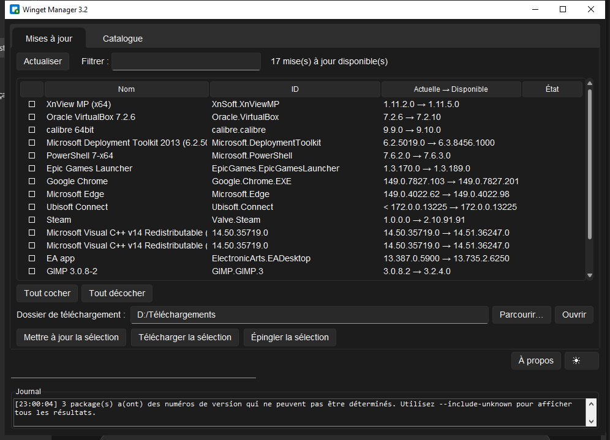
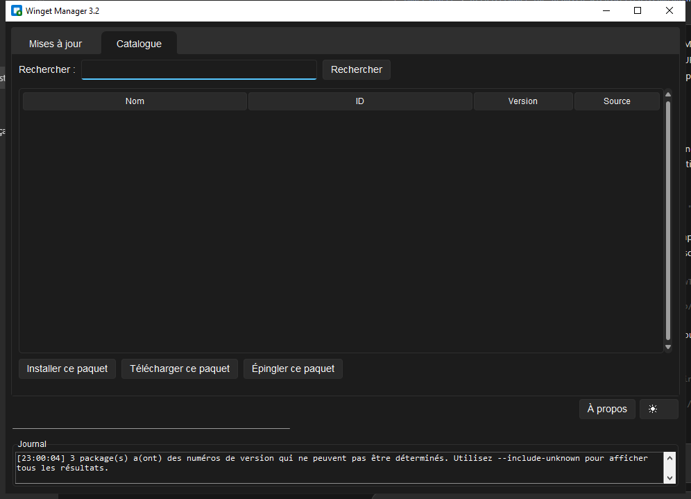

# Winget Manager

[Français](README.fr.md) · [English](README.md)

Une interface graphique Windows native et épurée pour **winget** — recherchez des paquets, installez-les, téléchargez les installateurs et gardez vos applications à jour sans jamais ouvrir de terminal.

Winget Manager enveloppe la CLI `winget` dans une interface Tkinter légère avec un look Windows 11 (thèmes clair & sombre), une progression en temps réel, des messages d'erreur lisibles, et des opérations par lot sur plusieurs paquets à la fois.

> Nécessite Windows 10/11 avec `winget` installé (App Installer, disponible sur le Microsoft Store).

---

## Fonctionnalités

- **Onglet Mises à jour** — liste toutes les mises à jour disponibles avec les versions actuelle → disponible, un filtre, une sélection multiple et la **mise à jour** ou le **téléchargement** par lot.
- **Onglet Catalogue** — recherchez dans le dépôt winget, consultez les détails d'un paquet (éditeur, site web, licence…), puis installez, téléchargez ou épinglez.
- **Progression en temps réel** — barres de progression dédiées pour les téléchargements (avec analyse au niveau de l'octet, type `21.0 MB / 67.1 MB`) et mode indéterminé pour les installations/mises à jour.
- **Décodage intelligent des erreurs** — les codes d'erreur winget/MSIX sont traduits en causes claires et en solutions concrètes (droits administrateur, paquet en cours d'utilisation, espace disque, réseau…).
- **Élévation administrateur** — quand une mise à jour requiert des privilèges élevés, un bouton « Relancer en tant qu'administrateur » apparaît automatiquement.
- **Gestion des téléchargements** — détecte les installateurs déjà téléchargés et demande s'il faut **remplacer**, **ignorer** ou **annuler** le lot entier.
- **Thèmes clair & sombre** — style Windows 11 via [sv_ttk](https://github.com/rdbende/Sun-Valley-ttk-theme), conservé entre les sessions.
- **Journal en direct** — flux d'activité horodaté où les chemins de fichiers sont cliquables pour les ouvrir directement dans l'Explorateur.
- **Épingler / ignorer des paquets** — figez un paquet à sa version courante pour qu'il n'apparaisse plus dans les mises à jour.
- **Aucune fenêtre de console** — livré avec un lanceur `.pyw` et un build `.exe` entièrement autonome.

---

## Captures d'écran

**Onglet Mises à jour** — mises à jour disponibles avec versions actuelle → disponible, sélection multiple et actions par lot.



**Onglet Catalogue** — recherchez dans le dépôt winget et inspectez les résultats avant d'installer.



---

## Installation

### Option 1 — Exécutable portable (recommandé)

1. Allez sur la page [Releases](../../releases).
2. Téléchargez `Winget-Manager.exe`.
3. Double-cliquez — c'est tout. Python est embarqué, rien à installer.

### Option 2 — Lancer depuis les sources

Nécessite **Python 3.8+** et `winget`.

```bash
git clone https://github.com/CordaAvlao/Winget-Manager.git
cd Winget-Manager
pip install sv_ttk
python "Winget Manager.pyw"
```

> `sv_ttk` est optionnel — s'il est absent, Winget Manager revient automatiquement au thème Tkinter natif.

### Option 3 — Construire votre propre exécutable

Nécessite Python, `pyinstaller` et `sv_ttk` :

```bash
pip install pyinstaller sv_ttk
build_exe.bat
```

L'exécutable autonome `Winget-Manager.exe` est généré dans `dist/`.

---

## Utilisation

1. Lancez **Winget Manager**. L'onglet **Mises à jour** se remplit automatiquement avec les mises à jour disponibles.
2. Utilisez la zone de filtre pour réduire la liste, puis cochez les paquets qui vous intéressent (ou *Tout cocher*).
3. Choisissez une action :
   - **Mettre à jour la sélection** — met à niveau chaque paquet coché.
   - **Télécharger la sélection** — récupère les installateurs dans votre dossier de téléchargement.
   - **Épingler la sélection** — fige les paquets à leur version actuelle.
4. Basculez sur l'onglet **Catalogue** pour découvrir et installer de nouveaux logiciels par leur nom.
5. Consultez le journal en bas pour un retour en temps réel et des chemins de fichiers cliquables.

Un fichier `config.json` est créé à côté de l'exécutable au premier lancement pour mémoriser votre dossier de téléchargement et votre préférence de thème.

---

## Pourquoi ce projet existe

`winget` est puissant, mais c'est un outil en ligne de commande. C'est très bien pour les développeurs, mais peu pratique au quotidien — vérifier les mises à jour, télécharger un installateur hors ligne, ou comprendre pourquoi une installation a échoué ne devrait pas nécessiter de mémoriser des flags et des codes d'erreur en hexadécimal.

Winget Manager apporte winget dans une interface de bureau conviviale tout en restant léger en dépendances (un seul fichier Python, une GUI de la bibliothèque standard, un paquet de thème optionnel) et entièrement portable.

---

## Pile technique

- **Python 3** — Tkinter (bibliothèque standard) pour l'interface.
- **sv_ttk** — thème Sun Valley pour un rendu Windows 11.
- **PyInstaller** — produit l'exécutable `.exe` autonome.
- **winget** — le gestionnaire de paquets sous-jacent (Windows 10/11).

---

## Structure du projet

```
Winget-Manager/
├── winget_manager.py      # Logique métier + interface (fichier unique)
├── Winget Manager.pyw     # Lanceur sans console
├── build_exe.bat          # Script de build PyInstaller en un clic
├── icon.ico               # Icône de l'application
├── config.json            # Généré à l'exécution (thème + dossier de téléchargement)
├── README.md
└── LICENSE
```

---

## Feuille de route

- Export / import de la liste des paquets installés.
- Vérifications automatiques des mises à jour en arrière-plan avec notifications.
- Visionneuse de changelog par paquet.
- Localisation (EN / ES / DE).

---

## Contribuer

Les contributions sont les bienvenues. Pour que tout se passe bien :

1. Forkez le dépôt et créez une branche de fonctionnalité.
2. Conservez l'architecture en fichier unique et la séparation entre la logique métier winget et le code de l'interface.
3. Testez sur de vraies opérations `winget` avant de soumettre.
4. Ouvrez une pull request décrivant le changement et pourquoi il compte.

Les rapports de bugs et les idées de fonctionnalités sont tout aussi précieux — merci d'utiliser l'onglet [Issues](../../issues).

---

## Soutenir le projet

Si vous appréciez ce projet et souhaitez soutenir son développement futur :

https://www.paypal.com/ncp/payment/NPGMPUL9N9TFQ

Votre soutien aide à améliorer le projet et à maintenir les futures mises à jour.

---

## Licence

Publié sous la [licence MIT](LICENSE).

---

## Auteur

**CordaAvlao**
